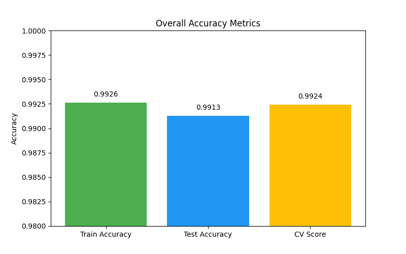
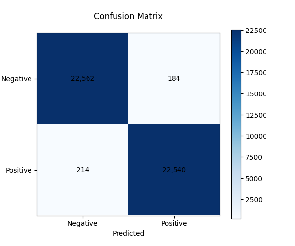

# CodeAlpha_Diseases_Prediction

This project involves building a web-based dashboard for predicting the risk of heart disease based on various health indicators. It features a logistic regression model trained on a health risk dataset, capable of assessing the likelihood of a positive diagnosis for a patient given features such as chest pain, shortness of breath, blood pressure, cholesterol, and more.

## Features

- **Interactive UI**: A modern, sleek web interface built with HTML, CSS, and Vanilla JavaScript.
- **Machine Learning**: Utilizes a Logistic Regression model implemented in Python (`scikit-learn`) to generate predictions.
- **Data Export**: Model weights and metadata are automatically extracted from Python into a `JSON` file (`model_weights.json`) enabling predictions to run locally in the browser via JavaScript without needing a backend server for inference.

## Model Performance & Overall Accuracy

The Logistic Regression model was evaluated on a held-out test set (35% of the data). Below are the overall accuracy metrics and the confusion matrix showing its performance on the test dataset.

- **Training Accuracy**: 99.26%
- **Testing Accuracy**: 99.13%
- **Cross-Validation Score (Mean)**: 99.24%
- **Error Rate**: 0.87%

### Accuracy Metrics

### Confusion Matrix

## Getting Started

1. **Model Weights**: If needed, you can re-extract the model weights by running `extract_model.py`. This will read the dataset, train the Logistic Regression model, and generate the `model_weights.json` file.
2. **Dashboard**: Open `index.html` in any modern web browser to interact with the prediction dashboard.
3. **Verification**: You can run `verify_model.py` to ensure the JavaScript implementation and Python implementation yield identical predictions for test cases.